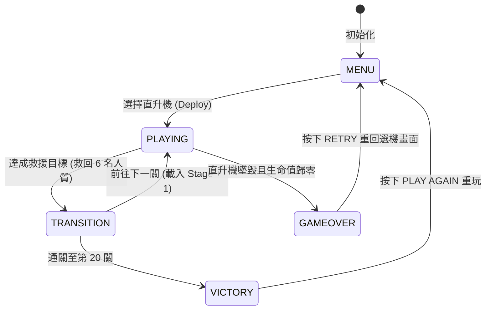
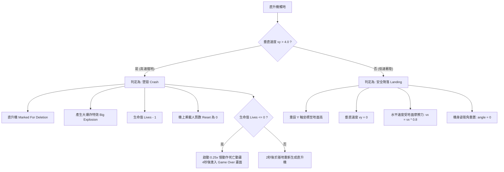
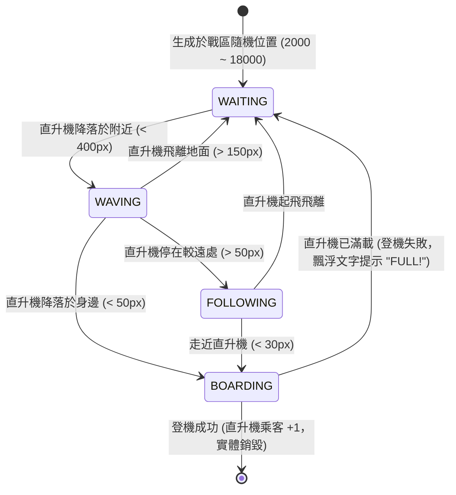

# Choplifter HD 遊戲規格書 (Game Specification)

本規格書詳述了 **Choplifter HD** 的系統設計、核心機制、物理引擎、實體類別結構以及視覺渲染技術。本專案為經典街機遊戲 *Choplifter*（直升機救人質）的現代高畫質網頁版複刻，完全基於網頁前端技術（HTML5 Canvas + 原生 JavaScript + CSS3）開發。

---

## 1. 專案簡介與核心玩法

**Choplifter HD** 是一款橫向捲軸射擊與救援模擬遊戲。玩家扮演搜救直升機飛行員，核心任務是飛往敵方戰區，避開或消滅地面的坦克，降落並接載受困的人質，最終將人質安全載回己方基地。

### 核心玩法迴圈 (Core Loop)
1. **起飛與探索**：自左側友軍基地起飛，向右飛行進入敵軍控制區。
2. **殲滅敵軍**：使用機載機槍消滅威脅人質與直升機的敵方坦克。
3. **降落救援**：安全降落於人質附近，人質會自動奔向並登機。
4. **滿載返航**：各直升機依機型有不同的最大載客人數（MD-500 為 3 人、CH-47 為 8 人、Airwolf 為 1 人）。裝載後返回基地降落。
5. **安全卸載**：降落於友軍基地後，人質將依序下車，換取分數與關卡進度。當救回目標人數時，即完成任務進入下一關。

---

## 2. 技術架構與自適應設計

專案採用**單檔案網頁應用程式 (Single-file Web Application)** 架構，遊戲核心程式碼、樣式及渲染邏輯全部整合於 `index.html` 中。

### 技術棧
* **結構 (HTML5)**: 用於承載 Canvas 畫布及遊戲暫停、選單、結束等 HUD UI 疊加層。
* **樣式 (CSS3)**: Vanilla CSS。使用 `Orbitron` Google Font 呈現軍事/科幻風格。
* **邏輯與渲染 (JavaScript & Canvas API)**: 使用 Canvas 2D 內容進行所有精靈、物理、背景及特效的即時繪製，主循環基於 `requestAnimationFrame`。

### 寬螢幕自適應設計 (Dynamic Aspect Ratio Scaling)
為了讓遊戲在任何螢幕比例的瀏覽器（包括 16:9、16:10 以及 21:9 超寬螢幕）中完美撐滿整個繪圖區域，且消除上下或左右黑邊（Letterbox / Pillarbox），遊戲實施了先進的「動態寬度擴展 + 固定垂直高度」自適應渲染引擎：
* **Canvas 高度**: 嚴格鎖定在 `1080` 像素 (`CANVAS_HEIGHT = 1080`)，以確保所有垂直重力、地面高度判定（Y 軸 980 處）及著陸碰撞公式 100% 物理一致性，從根本上避免了因視窗高度變化導致的直升機穿地或墜毀 Bug。
* **Canvas 寬度**: 變更為動態變量 `CANVAS_WIDTH`。當視窗發生 `resize` 時，根據視窗高度計算出縮放比 `scale = window.innerHeight / 1080`，進而推導出完美的物理渲染寬度：`CANVAS_WIDTH = window.innerWidth / scale`。
* **等比例全螢幕覆蓋**: 對 `#game-container` 元素動態設定寬為 `CANVAS_WIDTH`、高為 `1080px`，並套用 `transform: scale(scale)`，從而使繪圖區域無縫撐滿瀏覽器視區。
* **自適應 UI 佈局**: HUD overlay 採用 CSS Flexbox 與絕對定位配置，使計分板與剩餘命數能完美且動態地吸附於當前寬螢幕最左側與最右側的外邊框，並在遊戲畫面左下方以精緻的半透明樣式固定顯示操作說明字樣（`WASD to Fly | SPACE to Shoot | F for Fullscreen`），提供玩家即時提示且不干擾遊戲戰局。

### 視覺效果濾鏡 (CRT Scanlines Overlay)
利用 CSS 線性漸變（`linear-gradient`）疊加一個覆蓋整個 Canvas 的虛擬半透明層，以 `rgba(0, 0, 0, 0.1)` 繪製間隔為 4 像素的橫向條紋，營造出經典復古 CRT 螢幕的「掃描線（Scanlines）」視覺質感。

---

## 3. 核心遊戲機制與狀態機

遊戲的運行完全受控於遊戲引擎類別 `Game` 內的**狀態機 (State Machine)**。

### 遊戲狀態流轉


### 畫面切換控制與背景設計
所有選單與過渡畫面（開始畫面、選機畫面、關卡過渡、勝利、遊戲結束）均作為絕對定位的 HTML `div` 覆蓋並整合於 `#game-container` 之內。為了提供極致流暢的視覺體驗，**各畫面之間的切換均採用「先淡出 (Fade-Out) 再淡入 (Fade-In)」的轉場機制**。系統於遊戲引擎中實作了全域 transition 處理器 `fadeTransition(fromScreen, toScreen, callback)`，配合 CSS 中的 `transition: opacity 0.4s ease-in-out;`，使新舊畫面的交疊極其自然，大幅提升遊戲的精緻感。

#### 各畫面背景圖像與覆蓋設定
* **遊戲起始主畫面 (`#start-screen`)**:
  * 背景圖像：`images/cover-01.jpg`（完全覆蓋 1920x1080 範圍）
  * 視覺效果：結合 `linear-gradient` 提供 30% ~ 50% 的暗部漸變遮罩，確保標題字型之可讀性。
* **選機畫面 (`#selection-screen`)**:
  * 背景圖像：`images/selection-01.jpg`（完全覆蓋 1920x1080 範圍）
  * 直升機選項卡（`.chopper-card`）採用高階毛玻璃（Glassmorphism，半透明深色背景結合 `backdrop-filter: blur(8px)`）與懸停青色光暈微動畫。預覽框（`.preview-canvas`）設定為 `rgba(255, 255, 255, 0.25)` 半透明背景，並配有 `rgba(255, 255, 255, 0.3)` 的亮白色邊框，使直升機預覽浮空感更顯著、質感更為精緻。
  * **三架直升機選擇框大小一致**：設定固定寬度為 `400px`，名稱字體大小調降至 `20px`（縮小 10%），內部按鈕寬度 `100%` 自動適配，防止字體突出或換行。
  * **選項卡絕對定位佈局**（精準契合背景底圖美術設計）：
    * **CH-47 Chinook**：畫面左側 13% 位置，且向下移動 4%（`top: 271px; left: 13%; transform: translateX(-50%);`）
    * **AIRWOLF**：向下移動 18% 且向右移動至最右側減 2%（`top: 444px; right: 2%;`）
    * **MD-500 Defender**：中間下方偏右，且向下移動 6%、向左移動 6%（`bottom: 55px; left: 54%; transform: translateX(-50%);`）
    * **選機狀態說明 (`#chopper-preview`)**：放置於畫面上方中央（`top: 150px; left: 50%; transform: translateX(-50%);`）
* **關卡過渡 (`#level-screen`)、勝利 (`#victory-screen`)**:
  * 背景圖像：`images/bg-01.jpg`（完全覆蓋 1920x1080 範圍，結合 40% ~ 60% 暗色遮罩）。
* **遊戲結束畫面 (`#game-over-screen`)**:
  * 依據遊戲時所使用的直升機機型，分別動態顯示專屬背景圖（完全覆蓋 1920x1080 範圍，結合 40% ~ 60% 暗色遮罩）：
    * **Airwolf (`AIRWOLF`)**：`images/AIRWOLF_gameover.jpg`
    * **CH-47 Chinook (`CHINOOK`)**：`images/CH47_gameover.jpg`
    * **MD-500 Defender (`BLACK_HAWK`)**：`images/MD500_gameover.jpg`

### 關卡與難度曲線
* **基本目標**：每關過關的目標救援人數固定為 **6 名** 人質（`hostagesTarget = 6`）。
* **坦克數量**：隨關卡數呈線性增長，第 $N$ 關的坦克總數為 $3 + N$ 輛。
* **關卡上限**：遊戲設有 20 個關卡。通關第 20 關後，玩家將達成最終勝利。
* **時間循環**：時段以 4 關為一個週期循環：`黎明 (DAWN)` $\rightarrow$ `白天 (DAY)` $\rightarrow$ `黃昏 (DUSK)` $\rightarrow$ `夜晚 (NIGHT)`。
* **分數機制**：
  * 摧毀敵方坦克：**+100 分**
  * 成功將名人質護送至基地卸載：**+50 分**
* **生命值 (Lives)**：初始擁有 3 條命。UI 顯示的「剩餘命數」為 `Math.max(0, lives - 1)`（即當前生命減去直升機上這條命，代表後備直升機數量）。

---

## 4. 控制與操作設定

遊戲採用全鍵盤操作，支援全螢幕體驗：

| 按鍵 | 動作 | 詳細說明 |
| :--- | :--- | :--- |
| **W** | 引擎向上推进 (Thrust) | 克服重力，提供向上加速度。 |
| **A** | 向左飛行 / 傾斜 (Tilt Left) | 直升機機頭轉向左側，機身向左傾斜，並產生向左的加速度。 |
| **D** | 向右飛行 / 傾斜 (Tilt Right) | 直升機機頭轉向右側，機身向右傾斜，並產生向右的加速度。 |
| **Space (空白鍵)** | 發射武器 (Shoot) | 發射機載武器。MD-500 發射金色追蹤彈（冷卻 182ms），CH-47 投放慣性重力炸彈（冷卻 300ms），AIRWOLF 發射三向扇形飛彈（冷卻 211ms）。 |
| **F** | 切換全螢幕 (Fullscreen) | 切換瀏覽器全螢幕模式，增強沈浸感。 |

---

## 5. 物理引擎與運動模擬

遊戲在 2D 空間中實作了半寫實的動態物理模擬。直升機的運動受重力、推力、阻力、空氣摩擦力及姿態傾角的共同影響。

### 核心物理公式與常數

* **重力系統**：
  基底重力常數 `GRAVITY = 0.0525`。每幀垂直速度更新：
  $$vy \leftarrow vy + \text{GRAVITY} \times \text{gravityMod}$$

* **推進系統**：
  按住 `W` 鍵時，直升機獲得向上的推進力 `THRUST_POWER = 0.3`：
  $$vy \leftarrow vy - \text{THRUST_POWER} \times \text{thrustMod}$$

* **水平加速度**：
  水平基礎加速度為 `0.2`。依據按鍵與機型速度係數 `speedMod` 更新水平速度：
  * 按住 `A` (向左)：$$vx \leftarrow vx - 0.2 \times \text{speedMod}$$
  * 按住 `D` (向右)：$$vx \leftarrow vx + 0.2 \times \text{speedMod}$$

* **空氣阻力與摩擦力**：
  為防止速度無限增加，每幀皆會施加衰減係數：
  * 水平速度摩擦力：$$vx \leftarrow vx \times 0.98$$
  * 垂直空氣阻力：$$vy \leftarrow vy \times 0.99$$
  * 著陸後的地面摩擦力：$$vx \leftarrow vx \times 0.80$$

### 姿態傾角平滑插值 (Tilt Angle Interpolation)
直升機機身的旋轉角度 $\theta$（弧度）會隨飛行方向產生動態偏轉，以呈現逼真的慣性視覺效果：
* 靜止或無水平操作時：目標角度 $\theta_{target} = 0$
* 向左飛 (按 `A`) 時：目標角度 $\theta_{target} = -0.3\text{ rad}$
* 向右飛 (按 `D`) 時：目標角度 $\theta_{target} = 0.3\text{ rad}$
* 每幀角度過渡採用**線性插值 (LERP)** 演算法：
  $$\theta \leftarrow \theta + (\theta_{target} - \theta) \times 0.1$$

### 著陸與墜毀判定邏輯 (Landing & Crash System)
地平線高度固定為 `CANVAS_HEIGHT - 100` (即 Y 軸 980 處)。當直升機的底部接觸地面（即 $y > 980 - \frac{\text{height}}{2}$）時，將觸發以下判定：



---

## 6. 直升機機型差異與規格

玩家可於每局遊戲開始前挑選三種各具特色的直升機，其物理常數與外觀渲染皆有顯著差異：

| 機型名稱 | 內部標識 | 物理屬性修改器 | 武器與發射密度規格 | 外觀設計與動畫特徵 |
| :--- | :--- | :--- | :--- | :--- |
| **MD-500 Defender**<br>(美式輕型防衛者) | `BLACK_HAWK` | `gravityMod = 1.0`<br>`speedMod = 1.0`<br>`maxPassengers = 3` | **金色追蹤彈 (BULLET)**<br>• 發射密度：**110%**<br>• 射擊冷卻：**182ms** | 標準墨綠色軍用直升機。配有單頂部旋翼、尾翼以及底部起落架雪橇（Skids）。 |
| **CH-47 Chinook**<br>(契努克雙翼運輸機) | `CHINOOK` | `gravityMod = 0.8` (下降較慢)<br>`speedMod = 0.75` (水平略慢)<br>`maxPassengers = 8` | **重力慣性炸彈 (BOMB)**<br>• 發射密度：**66%**<br>• 射擊冷卻：**300ms**<br>• 特性：隨直升機水平速度 **120% 慣性**掉落，下墜重力減至原 **95%**，落地或直擊時殺傷範圍增加 33% (濺射半徑約為 112px)。 | 雙旋翼縱列式（Tandem Rotors）長機身。配有前/後兩組旋翼同步旋轉動畫，底部起落架為輪式。會依據水平飛行方向將駕駛艙車窗動態切換至左側或右側，從而實現雙向轉頭。 |
| **Airwolf**<br>(飛狼超音速直升機) | `AIRWOLF` | `gravityMod = 1.1` (下降偏快)<br>`speedMod = 1.41` (水平超音速)<br>`maxPassengers = 1` | **三向扇形飛彈 (MISSILE)**<br>• 發射密度：**95%**<br>• 射擊冷卻：**211ms**<br>• 特性：一次發射三發小型飛彈，飛彈間夾角為 4.5 度。 | 經典流線型黑白相間機身。繪製時利用 $Y$ 軸 $0.75$ 的縮放進行高度壓扁，使其顯得更加低矮修長，尾翼流線化，不顯示起落架（收回狀態）。 |

> [!NOTE]
> 經過調整後，Airwolf 展現了其標態性的超音速性能，其水平速度修改器 `speedMod` 已大幅提升至 `1.41`，但代價是最大乘載量被壓縮至極低的 `1` 人。而 CH-47 則展現了極高的乘載力（`8` 人），但也承受著較慢的飛行速度（`speedMod = 0.75`）。

---

## 7. 實體系統設計 (Entity System Class Reference)

遊戲採用物件導向的實體架構。所有動態角色皆繼承自 `Entity` 基底類別。

```
Entity (基底類別)
 ├── Helicopter (玩家直升機)
 ├── Hostage (人質)
 ├── Tank (敵方坦克)
 ├── Projectile (子彈)
 └── Particle (爆炸粒子)
```

### 7.1 Entity (基底類別)
包含所有實體共享的基礎物理屬性及介面：
* `x`, `y`：世界坐標。
* `vx`, `vy`：水平與垂直速度。
* `width`, `height`：碰撞包圍盒尺寸。
* `markedForDeletion`：標記刪除旗標，為 `true` 時將於下一幀被引擎清除。
* `update(dt)` / `draw(ctx)`：每幀更新與繪製的抽象虛擬方法。

### 7.2 Helicopter (直升機)
* **物理更新**：處理鍵盤輸入（W/A/D），套用重力與空氣阻力，並處理與天花板（夾緊於 $y=50$）及地面的碰撞。
* **人質載運**：
  * 載客上限：依機型而定（MD-500 為 3 人、CH-47 為 8 人、Airwolf 為 1 人）。
  * 搭載上限限制行為：若直升機乘客數已達最大載客上限，人質即便跑到直升機旁（於降落時）也無法登機，會持續在地面上等待/跑動，直至直升機有空位為止。
  * **卸載機制**：當直升機處於基地範圍內（$x < 400$ 且 $y > \text{CANVAS\_HEIGHT} - 150$）且載有人質時，每隔 0.2 秒（`unloadTimer > 0.2`）釋放一名人質。此時分數增加 50 分，關卡進度 `hostagesRescued` 加 1。
* **武器發射**：按空白鍵時，若冷卻計時已過，則發射該機型特定的武器，並觸發持續 0.05 秒的槍口閃光（Muzzle Flash）：
  * **MD-500 Defender**：以 182 毫秒冷卻（110% 密度）發射單發金色追蹤彈，子彈初速疊加直升機水平速度 $vx$。
  * **CH-47 Chinook**：以 300 毫秒冷卻（66% 密度）釋放重力炸彈，炸彈繼承直升機水平速度 $vx$ 的 **120% 慣性影響**，並以垂直重力加速度的 **95%**（`vy += 0.2375`）掉落，觸地或直擊時觸發大範圍濺射傷害（Splash Damage）。
  * **Airwolf**：以 211 毫秒冷卻（95% 密度）發射三向扇形飛彈，飛彈間的夾角為 $4.5^\circ$（$0.0785\text{ rad}$）。

### 7.3 Hostage (人質)
人質擁有完整的 AI 行為狀態機，用以模擬與直升機的互動：



* **移動與奔跑姿勢動畫**：處於 `FOLLOWING` 狀態時，人質會以每幀 1.4 像素的速度朝直升機奔跑（原速度 2 像素減少 30%）。為了呈現逼真的手腳擺動奔跑姿勢，系統實作了基於 Sine 與 Cosine 相位差 $90^\circ$ 的手腳協調動畫（擺動頻率為每秒 18 弧度）：
  * **雙腿擺動**：以 `Math.sin(cycle) * 7` 控制前後腿的交替擺動。
  * **雙手擺動**：以 `Math.cos(cycle) * 8` 控制前後手的交替擺動，呈現極具動感且協調的奔跑姿勢。
  * **站立姿勢優化**：當處於靜止（`WAITING`）狀態且非招手或登機時，會繪製兩條獨立的雙腿（而非單一色塊），並在身體兩側繪製自然下垂的雙臂，使人物質感更細緻。
* **招手動畫**：處於 `WAVING` 狀態時，人質會站立並上下揮舞雙臂（雙臂終點坐標隨時間正弦波動）。
* **增援機制 (Reinforcements)**：為防止人質被坦克全數殲滅導致關卡無法通關，遊戲設計了後援系統。不論關卡當前剩餘人質數為何，每隔 60 秒，系統會自動在戰區隨機位置（$x: 2000 \sim 18000$）生成一名新的人質，並在畫面上方噴出黃色提示字樣 `"REINFORCEMENTS DETECTED!"`。這項增援人質**不會**增加過關的目標基準值（保持為 6），讓通關容錯率大幅提升。

### 7.4 Tank (敵方坦克)
* **分布**：在世界坐標 $x: 1500 \sim 18500$ 之間隨機分佈。
* **瞄準 AI**：每幀計算坦克本體與直升機的直線距離。當距離小於 1000 像素時，砲塔會自動旋轉，瞄準玩家直升機中心點：
  $$\theta_{turret} = \text{atan2}(dy, dx)$$
* **射擊邏輯**：當直升機進入射程（水平距離小於 800 像素）且發射冷卻計時器小於等於 0 時，坦克會發射一枚帶有橘紅色軌跡的敵對子彈，並隨機重設冷卻計時器為 $2.0 \sim 4.0$ 秒之間，同時砲口處會亮起持續 0.1 秒的開火閃光。

### 7.5 Projectile (投射物/武器)
* **類型與運動模型**：
  * **金色追蹤彈 (BULLET)**：寬 10、高 4。速度為每幀 15 像素，初速疊加直升機 $vx$。
  * **重力慣性炸彈 (BOMB)**：寬 24、高 12。繼承直升機 launch 時水平速度 $vx$ 的 **120% 慣性影響**，垂直速度在重力作用下每幀以原來之 95% 加速（`vy += 0.2375`）。
  * **三向扇形飛彈 (MISSILE)**：寬 18、高 8（略小於炸彈的 24x12）。以每幀 18 像素的速度朝三向扇形角度（夾角 $4.5^\circ$）發射。
  * **敵方砲彈 (ENEMY BULLET)**：半徑 4 的圓形，朝直升機方向以每幀 15 像素發射。
* **碰撞偵測與濺射傷害 (Collision & Splash Damage)**：
  * **標準碰撞 (AABB)**：當追蹤彈或飛彈的中心座標位於敵方坦克或玩家直升機的包圍盒內時判定命中。
  * **螢幕顯示範圍限制作戰**：為了維持視野範圍內戰鬥的公平性與回饋感，**三架直升機發射的所有子彈、飛彈以及炸彈，皆無法攻擊或摧毀畫面顯示以外（橫向視界邊界之外）的坦克**。在進行 AABB 碰撞檢測與炸彈濺射傷害計算前，會先過濾坦克的世界坐標 $x$ 是否處於當前螢幕顯示範圍 `[-camX, CANVAS_WIDTH - camX]` 區間之內。
  * **重力炸彈爆破與濺射範圍**：當炸彈與坦克發生 AABB 碰撞，或觸及地平線（$y > 980$）時，將觸發 `explode()`。
    * **殺傷範圍公式**：比原範圍增加 33%，濺射半徑約為 $112\text{ px}$（約為炸彈寬度 $24\text{ px}$ 的 $4.655$ 倍）：
      $$\text{Radius} = 24 \times 4.655 = 111.72\text{ px} \approx 112\text{ px}$$
    * **效果**：在此半徑內的所有坦克皆會被判定摧毀，觸發大爆炸並在畫面上浮現黃色 `"SPLASH!"` 文字。
* **生命期與邊界銷毀**：炸彈生存期為 5.0 秒，飛彈為 3.0 秒，追蹤彈為 2.0 秒。觸地或超時後自動銷毀（炸彈會先爆破）。

### 7.6 Particle (爆炸粒子)與 FloatingText (浮動文字)
* **爆炸特效**：
  * **小爆炸 (SMALL)**：子彈擊中目標時產生，生成 10 個隨機橘黃色粒子，擴散速度較慢。
  * **大爆炸 (BIG)**：直升機墜毀或坦克被摧毀時產生，生成 40 個橙黃色爆炸粒子，外加部分深灰色煙霧粒子（`#444`），擴散半徑與初速大幅提升。
  * 粒子在運動過程中會受到重力加權（$vy$ 每幀增加 $0.05$）並隨時間衰減透明度直至銷毀。
* **浮動文字與感謝訊息**：
  在特定事件發生時，在指定坐標生成文字，並在 1.5 秒的生命週期內不斷向上飄移（$vy = -1$）且線性淡出：
  * **登機救援成功**：移除原來的 `"SAVED!"` 浮動文字以簡化畫面。改為在直升機（玩家）上方隨機噴出同義英文口語感謝訊息（如 `"Thank You!"`, `"Thanks, Captain!"`, `"You saved me!"`, `"Freedom at last!"`, `"Cheers, mate!"`, `"Saved!"`, `"Much obliged!"`），且每位人質登機時的感謝訊息會依序在三種高對比霓虹色（青色 `#0ff`、洋紅色 `#f0f`、金色 `#ff0`）中輪流切換，大幅提升多重救援時的視覺動態回饋。
  * **直升機滿載**：於人質登機位置噴出紅色 `"FULL!"` 浮動文字，且人質無法登機。
  * **後援偵測**：於畫面上方噴出黃色 `"REINFORCEMENTS DETECTED!"`。

---

## 8. 視覺渲染與視差滾動技術

為了在 2D 平面上呈現逼真的空間縱深感，遊戲結合了多種進階 Canvas 繪圖技術。

### 8.1 視差滾動背景 (Multi-layered Parallax Scrolling)
相機中心點會平滑追隨直升機水平坐標 $x$：
$$\text{camX}_{target} = -x_{player} + \frac{\text{CANVAS\_WIDTH}}{3}$$
相機移動採用插值以保持鏡頭平穩：
$$\text{camX} \leftarrow \text{camX} + (\text{camX}_{target} - \text{camX}) \times 0.1$$
相機邊界被嚴格限制在 $[-(20000 - 1920), 0]$ 之間。

背景分為四個渲染層，隨相機移動的速度比率各不相同，營造立體深度：
1. **天空背景層 (Sky Layer, 滾動率 0%)**：固定不隨相機移動。
2. **遠山第一層 (Far Mountains, 滾動率 10%)**：隨相機移動 $\text{camX} \times 0.1$。
3. **中山第二層 (Mid Mountains, 滾動率 30%)**：隨相機移動 $\text{camX} \times 0.3$。
4. **近山第三層 (Near Mountains, 滾動率 60%)**：隨相機移動 $\text{camX} \times 0.6$。

#### 山脈平滑無接縫渲染演算法
為了防止在超大地圖中滾動時山脈圖案邊緣出現截斷或閃爍，繪製山脈的自訂方法 `drawMountainLayer` 採用了**正向取模循環演算法**：
```javascript
const patternWidth = 2000;
const offset = ((scrollX % patternWidth) + patternWidth) % patternWidth;
```
山脈邊界在 $x$ 軸從 $-\text{patternWidth}$ 繪製到 $\text{CANVAS\_WIDTH} + \text{patternWidth}$，並將每個節點的橫坐標加上該循環偏移量 `offset`。山脊高度則使用 Sine 噪聲疊加公式即時生成：
$$y = \text{CANVAS\_HEIGHT} - \text{baseHeight} + (\sin(wx \times 0.005) + \sin(wx \times 0.01) \times 0.5) \times \text{variance}$$
此演算法保證了山脊的起伏在無限移動時呈現自然的有機感，且毫無接縫。

### 8.2 時間與天體渲染系統 (Celestial & Atmospheric Render)
隨關卡時間循環，天空與天體會重新渲染：
* **天空漸變**：
  * **DAWN (黎明)**：深藍灰色 $\rightarrow$ 暗紅色 $\rightarrow$ 橙黃色漸變。
  * **DAY (白天)**：蔚藍色 $\rightarrow$ 淺藍色漸變。
  * **DUSK (黃昏)**：深紫紅色 $\rightarrow$ 暗棕紅色 $\rightarrow$ 亮橘色漸變。
  * **NIGHT (夜晚)**：極深藍黑色 $\rightarrow$ 深海藍色漸變。
* **天體 (Celestial Body)**：
  * **太陽 (SUN)**：於黎明與白天生成。使用兩層圓形繪製，底層為徑向漸變（Radial Gradient）發光圈（套用 Canvas 混色模式 `screen` 實現強烈曝光感），表層為實心亮色圓形。
  * **月亮 (MOON)**：於黃昏與夜晚生成。利用實心白色圓形作為月亮本體，並應用 `source-over` 混色模式，在偏移量處繪製一個與背景天空色相近的圓形作為「月相遮罩」，呈現自然的彎月效果。
* **星星 (Stars)**：在黎明、黃昏與夜晚，於天空中隨機散佈 100 顆星星。使用固定的偽隨機種子坐標確保星星位置固定，並每幀微調其透明度以實現閃爍特效。

### 8.3 友軍基地 (Landing Base)
地圖左端 $x: 100 \sim 400$ 設為避難基地：
* 繪製高 20 像素的混凝土停機坪平台。
* 在 $x: 150 \sim 250$ 處繪製一棟深色基地指揮所大樓。
* 在 $x: 200$ 處繪製一根白色旗桿，並在桿頂繪製一面紅色三角形友軍旗幟。

---

## 9. 遊戲系統常數一覽表

以下整理了 Choplifter HD 原始碼中的所有核心數值，方便後續平衡度調整：

| 變數/常數名稱 | 設定數值 | 物理/邏輯意義說明 |
| :--- | :--- | :--- |
| `CANVAS_WIDTH` | `1920` | 遊戲虛擬解析度寬度 (像素) |
| `CANVAS_HEIGHT` | `1080` | 遊戲虛擬解析度高度 (像素) |
| `GRAVITY` | `0.0525` | 基礎垂直向下的重力加速度 |
| `FRICTION` | `0.98` | 水平運動時面臨的空氣摩擦係數 |
| `THRUST_POWER` | `0.3` | 按住 W 鍵時獲得的垂直向上推進力 |
| `ROTATION_SPEED`| `0.05` | 控制姿態翻轉的速度常數 (程式未直接參照，由 LERP 的 0.1 代替) |
| `MAX_SPEED` | `12` | 設計最大速度上限 (保留常數) |
| 地圖寬度上限 | `20000` | 可飛行的世界地圖總寬度 (像素) |
| 基地停機坪範圍 | `100 ~ 400` | 可安全降落並卸載人質的水平區間 |
| 安全著陸垂直速 | `4.0` | 降落時 `vy` 超過此值即判定為墜毀 |
| 人質乘載上限 | 依機型而定 (1/3/8) | 每台直升機最多能同時搭載的人質數量 |
| 人質過關目標數 | `6` | 每一關必須送回基地的人質基準數 |
| `射擊冷卻時間` | 依機型而定 | MD-500: **182ms** (110%)<br>CH-47: **300ms** (66%)<br>AIRWOLF: **211ms** (95%) |
| 人質後援計時器 | `60s` | 戰區自動生成新救援目標的冷卻時間 |
| 坦克射擊冷卻時間| `2.0 ~ 4.0` | 敵方坦克瞄準開火的隨機冷卻間隔 (秒) |

---

## 10. 行銷與數據追蹤整合

本專案於 `head` 標籤中整合了 **Google Analytics 4 (GA4)**。
* **追蹤 ID (Measurement ID)**: `G-BFHFDEFX4Y`
* **觸發時機**: 網頁載入時自動初始化並發送 `page_view` 事件，用以追蹤玩家造訪量與留存率。
